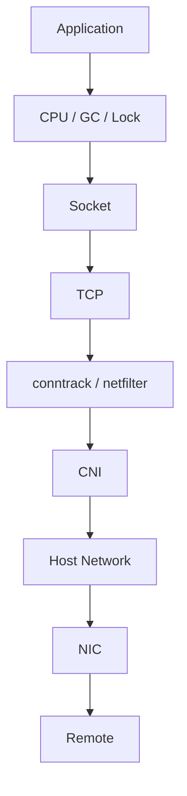

# 19 Troubleshooting / Performance

## 学习目标

形成从应用到内核、网络和远端依赖的分层排障路径。

## 知识清单

- CPU
- Memory
- Disk IO
- Network
- Linux tools
- Kubernetes troubleshooting
- pprof
- perf
- tcpdump
- ss
- strace
- bpftrace
- 故障案例

## 排障路径

## 实践建议

围绕真实故障现象选择工具并记录证据链，避免只罗列命令。
