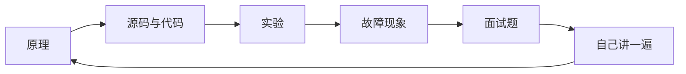

# 面试准备知识库

这里是 HTML 阅读站点首页。知识源统一使用 Markdown，站点负责渲染搜索、代码高亮、表格以及 Mermaid 流程图。



## 本地预览

```bash
python3 -m venv .venv-docs
source .venv-docs/bin/activate
pip install -r requirements-docs.txt
mkdocs serve
```

浏览器访问终端显示的本地地址。生成静态 HTML 时运行：

```bash
mkdocs build --strict
```

生成结果位于 `site/`。
